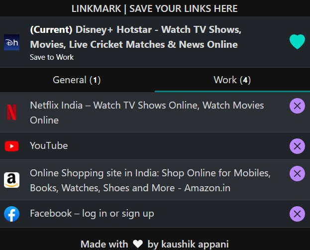
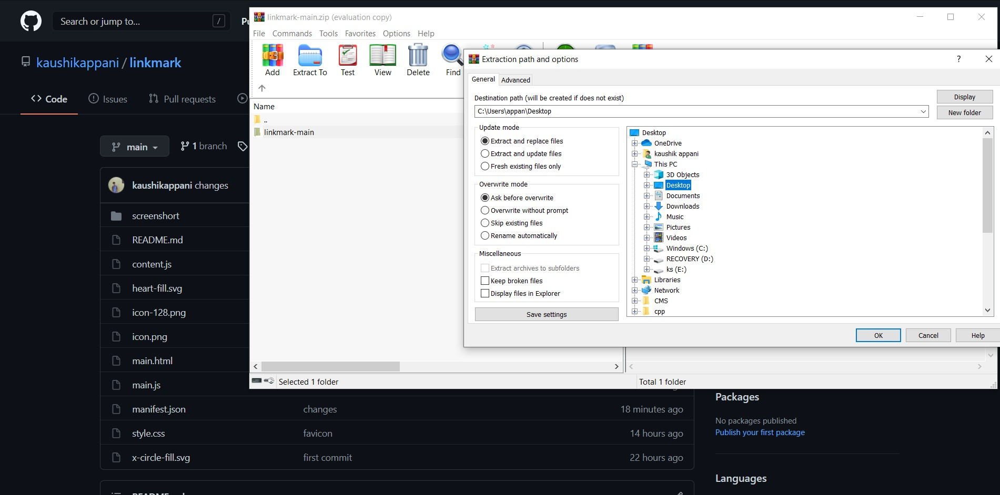

  # Linkmark | Save links for future

A simple Web browser extension build with javascript to save links 
 ## UI/UX

  
 

## Usage Instructions

* Download the zip file from github.

  
 

 * Unzip the downloaded file.

  
 

  * Open web browser (Opera, Google Chrome, Microsoft Edge) and click on ** Manage extensions **.

  
 

  * ** Turn on the developer mode ** and click on the ** Load unpacked ** and select the extracted (unzip file) file.

  
 

  * Pin linkmark and start saving links.

  
 
